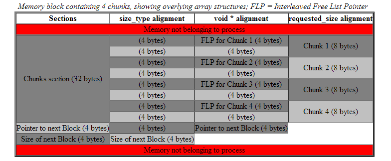

# Notes

## pool类
boost pool主要由两个类构成:
* 一个是底层的`simple_segregated_storage`，负责将分配到的block分散为chunks，并且将所有空闲的chunks用一个链表串联起来
  
alignment要考虑到chunk中所有可能的数据类型，所以section1虽然用不到size_type,但是也要为此做合适的padding
* 另一个是上层的`pool`，负责向系统申请内存，交由底层`storage`管理

`pool`和`storage`的组合方式如下
```C++
   pool:protected storage{
       storage& store(){
        return  *this;
       }
   }
```

## guard类(RAII)
`guard`用来保护`mutex`
```C++
class guard{
    Mutex & mutex;
    explicit guard(Mutex& mtx):mutex(mtx){
        mutex.lock();
    }
    ~guard(){
        mutex.unlock();
    }
}
```
pool类这样使用`guard`:
```C++
struct pool_type:public mutex,public pool{
    "default construtor"
}
pool_type p;
void test(){
    guard(p);
    p.process();
}
```
可以防止忘记归还资源

## 宏
boost中用到了很多的宏，如：
* `<mutex.hpp>`中根据不同的平台和C++版本定义了不同的mutex
* ```C++
  void * malloc BOOST_PREVENT_MACRO_SUBSTITUTION
  ```
  可以防止宏展开对函数的影响，该函数使用时要加括号：
  ```C++
  auto p=(malloc)();
  ```
* 通过宏来定义一些静态常量
  ```C++
  BOOST_STATIC_CONSTANT(size_type, min_alloc_size =
        (::boost::integer::static_lcm<sizeof(void *), sizeof(size_type)>::value) );
  ```

## 其他
还有一些其他技巧，如编译期计算一些简单的量
```C++
integer::static_lcm<sizeof(size_type), sizeof(void *)>::value
```